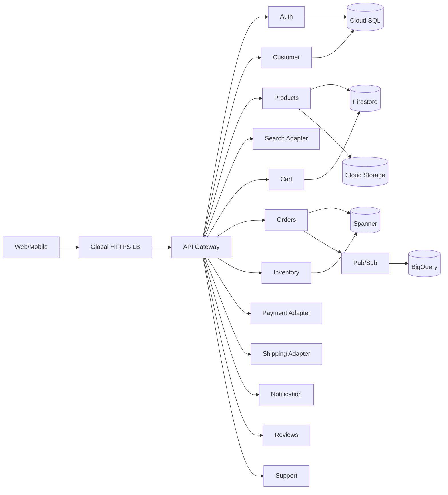
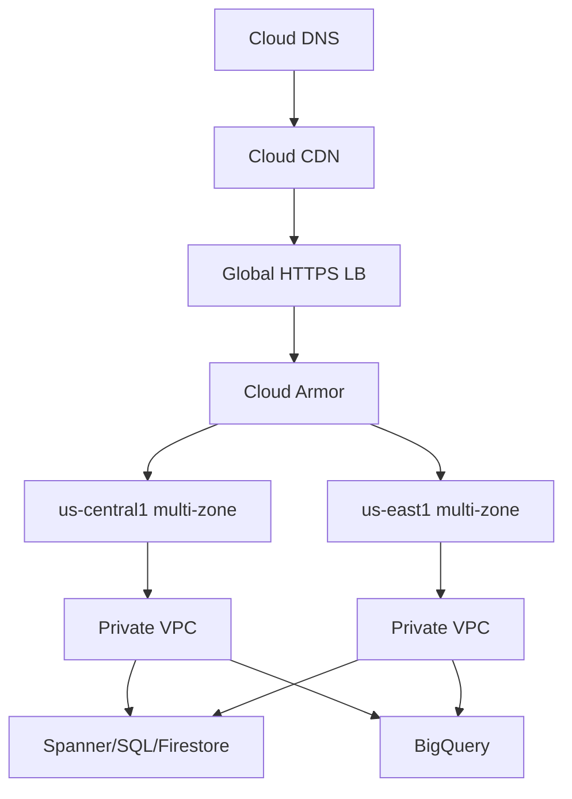
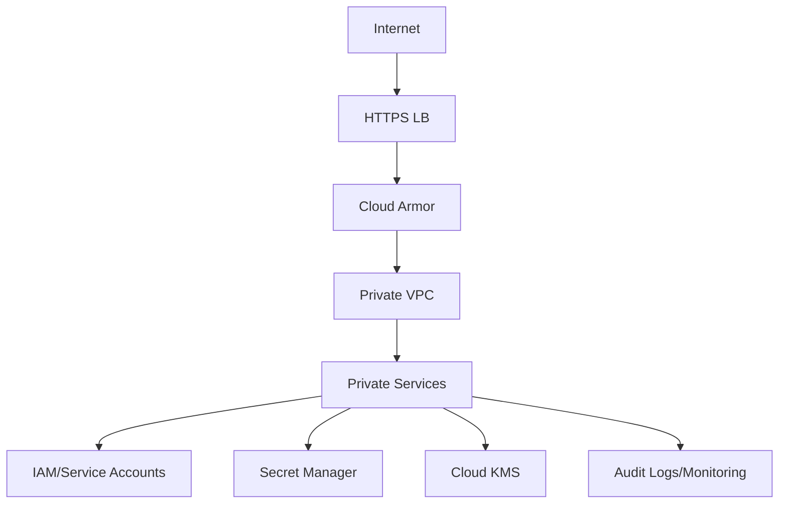

# ShopCloud — Google Cloud Architect Workbook

## 1. Case study
ShopCloud is a cloud-native e-commerce platform for registration, catalogue/search, cart, wishlist, checkout, orders, inventory, payment/shipping adapters, reviews, support and analytics.

**Roles:** Customer, Admin, Support/Operations, Warehouse/Inventory.

## 2. Personas and stories
**Maya (Customer):** mobile-first shopper who wants fast discovery, secure checkout and reliable tracking.

**Victor (Operations):** manages catalogue and stock and needs accurate inventory, alerts and reporting.

Stories: (1) customer searches and filters products; (2) customer completes secure checkout; (3) operations manager monitors inventory and low-stock alerts.

## 3. SLI/SLO
| Service | Availability | Target |
|---|---:|---|
| Web/Mobile UI | 99.95% | P95 <300ms |
| Auth | 99.99% | P95 <250ms |
| Catalogue | 99.95% | P95 <300ms |
| Cart/Checkout | 99.95% | P95 <500ms |
| Orders | 99.99% | P95 <500ms |
| Inventory | 99.99% | P95 <300ms |
| Payment Adapter | 99.95% | P95 <2s |
| Notifications | 99.90% | P95 <1s |
| Customer DB/Orders DB | 99.99% | P95 <150ms |
| Warehouse | 99.50% | query <10s |

## 4. Microservices

## 5. REST API
`POST /auth/login|refresh`; `GET/POST/PATCH /customers`; `GET/POST/PATCH /products`; `GET/POST /categories`; `GET/POST/PATCH/DELETE /cart`; `GET/POST/PATCH /orders`; `GET/POST/PATCH /inventory/{sku}`; `GET/POST /payments`; `GET/POST/PATCH /shipments`; `GET/POST /products/{id}/reviews`; `GET/POST /notifications`; `GET/POST/PATCH /tickets`; `POST /events`.

## 6. Storage
Identity/customer/order/inventory data use structured SQL with strong consistency. Product/cart documents can use Firestore. Product media/backups use Cloud Storage. Optional high-volume telemetry can use Bigtable. Analytics uses BigQuery with TB-PB scale.

## 7. GCP services
Persistent Disk for attached block storage; Cloud Storage for media/backups; Cloud SQL for relational operations; Firestore for product/cart documents; Bigtable for high-volume telemetry; Spanner for globally consistent orders/inventory; BigQuery for analytics.

## 8. Network and load balancing
Public HTTPS enters a global external HTTPS Application Load Balancer protected by Cloud Armor. Private services use a custom VPC and internal load balancing. TCP/HTTPS is the primary transport. Multi-region: `us-central1` + `us-east1`.

## 9. Network diagram

## 10. Reliability/scalability
Multi-zone compute, autoscaling, health checks, global routing, CDN caching, Pub/Sub events, Spanner transactional consistency, replicated object storage and centralized monitoring.

## 11. Disaster recovery
Primary `us-central1`, secondary `us-east1`. **Orders DB:** near-zero RPO/5-min RTO/Critical. **Inventory:** near-zero/5-min/Critical. **Auth:** 5-min/10-min/Critical. **Catalogue:** 15-min/30-min/High. **Reviews:** 24-hr/1-hr/Medium. **Analytics:** 24-hr/4-hr/Medium. Cloud SQL uses automated backup + PITR; Spanner uses multi-region replication; Cloud Storage protects media/backups; source/IaC/Artifact Registry enable redeployment.

## 12. Security

TLS, least-privilege IAM, private databases, WAF protection, restricted egress, firewall segmentation, secrets management, optional CMEK, logging, vulnerability scanning and alerting. Never commit credentials.

## 13. Cost planning
| Group | USD/month estimate |
|---|---:|
| Compute | 400–1,000 |
| Spanner/Cloud SQL | 500–1,300 |
| Firestore/Bigtable | 200–700 |
| BigQuery | 150–500 |
| Storage/CDN/network | 250–800 |
| Security/observability | 200–600 |
| Backups | 50–200 |
| **Total planning range** | **1,750–5,100** |

Planning estimate only; validate production assumptions with the current Google Cloud Pricing Calculator.
